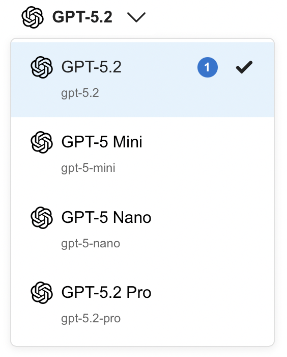

# AI Assistant
This project lets users chat with the top 10 leading AI models all in one place. Whether it's for school, research, or productivity users can compare responses, explore different AI capabilities, and get answers instantly all from a single user-friendly platform.

## Screenshots

### AI Assistant Chat window


### Model Dropdown Menu


## How to Run

### Prerequisites
- Node.js (v18 or higher)
- PostgreSQL 17
- npm or yarn

### Database Setup

1. Create a PostgreSQL database:
```bash
createdb your_database_name
```

2. Configure your database connection by creating a `.env` file in the `backend/` directory:
```env
DB_HOST=localhost
DB_PORT=5432
DB_USER=your_username
DB_PASSWORD=your_password
DB_NAME=your_database_name
JWT_SECRET=your_jwt_secret_key
NODE_ENV=development
```

3. Initialize the database:
```bash
cd backend
npm install
npm run init-db
```

### Backend Setup

1. Navigate to the backend directory:
```bash
cd backend
```

2. Install dependencies:
```bash
npm install
```

3. Start the backend server:
```bash
# Development mode (with auto-reload)
npm run dev

# Production mode
npm start
```

The backend server will typically run on `http://localhost:3000` (or the port specified in your environment variables).

### Frontend Setup

1. Navigate to the frontend directory:
```bash
cd frontend
```

2. Install dependencies:
```bash
npm install
```

3. Start the development server:
```bash
npm run dev
```

The frontend will typically run on `http://localhost:5173` (Vite's default port).

### Running the Full Application

1. Start the database (if not already running)
2. Start the backend server (in one terminal):
```bash
cd backend
npm run dev
```

3. Start the frontend server (in another terminal):
```bash
cd frontend
npm run dev
```

4. Open your browser and navigate to the frontend URL (typically `http://localhost:5173/chat`) and start asking questions!

